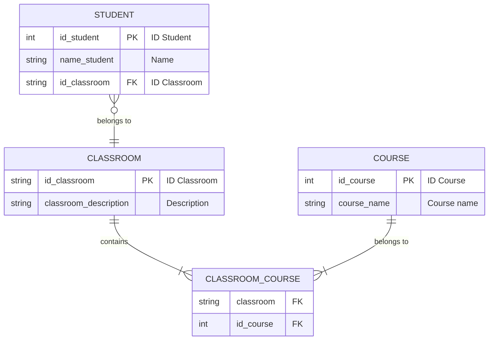
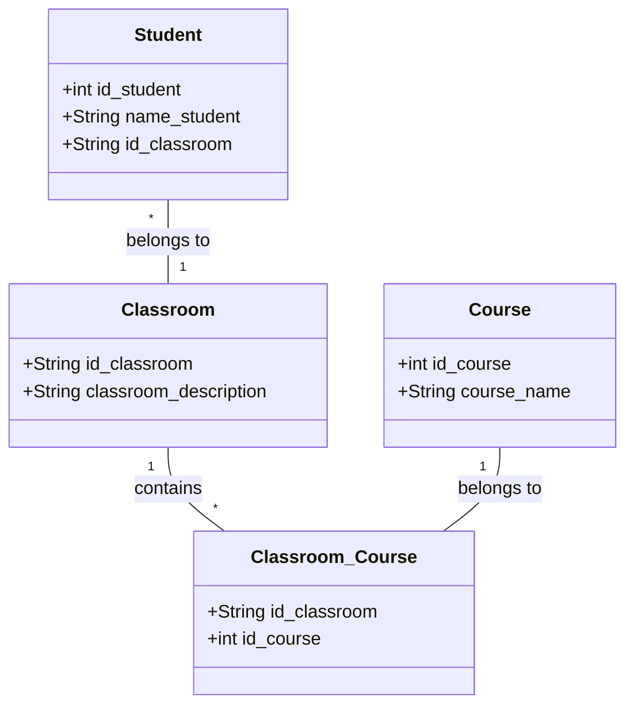

 # Normalización de Bases de Datos

### Instrucciones:

    - Descarga el pdf donde encontrarás una tabla de datos sin normalizar
    - Normaliza la tabla (se recomienda el uso de Google Sheets)
    - Realiza un diagrama ER de Chen
    - Realiza un diagrama de tipo patas de gallo
    - Crea un repositorio con el Readme
    - Inserta en el Readme la descripción del ejercicio así como los diagramas creados.

## Normalización paso a paso

### 1NF
- Quitar grupos repetidos de cursos ( course1, course2, course3)
- Separar entidades: students, classroom, course. Los cursos no dependen del estudiante, sino del aula.

    - STUDENT (id_student PK, name_student, classroom)
    - CLASSROOM (id_classroom PK, classroom_description)
    - COURSE (id_course PK, course_name)

### 2NF
- Los cursos dependen del aula, no del estudiante, por tanto no se relacionan Student con Course.

    - STUDENT (id_student PK, name_student, classroom FK→CLASSROOM)
    - CLASSROOM (id_classroom PK, classroom_description)
    - COURSE (id_course PK, course_name)
    - CLASSROOM_COURSE (id_classroom FK, id_course FK)

### 3NF

    - STUDENT (id_student PK, name_student, classroom FK→CLASSROOM)
    - CLASROOM (id_classroom PK, classroom_description)
    - COURSE (id_course PK, course_name)
    - CLASSROOM_COURSE (id_classroom FK, id_course FK)

## Diagrama ER de Chen

## Diagrama UML
